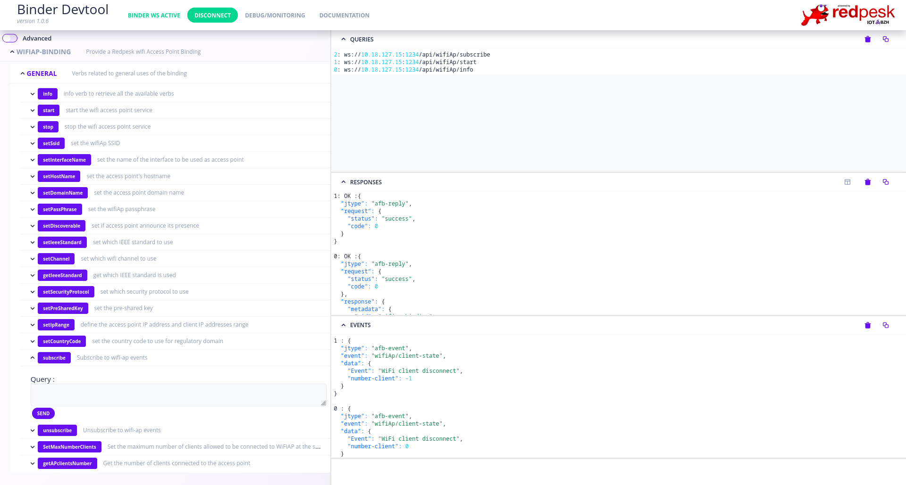

# WiFi Access Point Binding

* Object: This WiFi service API provides an fully customized WiFi access point
* Status: Entirely integrated within redpesk [afb-v4](https://docs.redpesk.bzh/docs/en/master/developer-guides/docs/overview-dev.html) libraries

The `wifiap-binding` exposes a simple mechanism to manage a WiFi access point through a standard set of REST/Websocket APIs. You can configure the access point using a JSON file or a set of custom commands to set parameters such as IP ranges, number of clients, SSID, password, channel used, etc.

## Based on AFB V4 micro-service architecture

`wifiap-binding` can be used in standalone to provide a simple secure HTML5 interface to manage your WiFi access point.
When used in conjunction with AFB framework its also leverage SeLinux/Smack to check API access with Cynagora.



You can also use `afb-client` which does the same but in command line:

```bash
$ afb-client -H ws://10.18.127.15:1234/api
wifiAp setSsid testAP
ON-REPLY 1:wifiAp/setSsid: OK
{
  "jtype":"afb-reply",
  "request":{
    "status":"success",
    "code":0
  }
}
wifiAp setIpRange {"ip_ap" : "192.168.2.1", "ip_start" : "192.168.2.10" , "ip_stop" : "192.168.2.100", "ip_netmask" : "255.255.255.0"}
ON-REPLY 7:wifiAp/setIpRange: OK
{
  "jtype":"afb-reply",
  "request":{
    "status":"success",
    "code":0
  }
}
wifiAp start
ON-REPLY 1:wifiAp/start: OK
{
  "jtype":"afb-reply",
  "request":{
    "status":"success",
    "code":0
  }
}

[...]

```

**Detailed documentation on the [redpesk-docs](https://docs.redpesk.bzh/docs/en/master/redpesk-core/wifiap-binding/1_Architecture.html) website**
